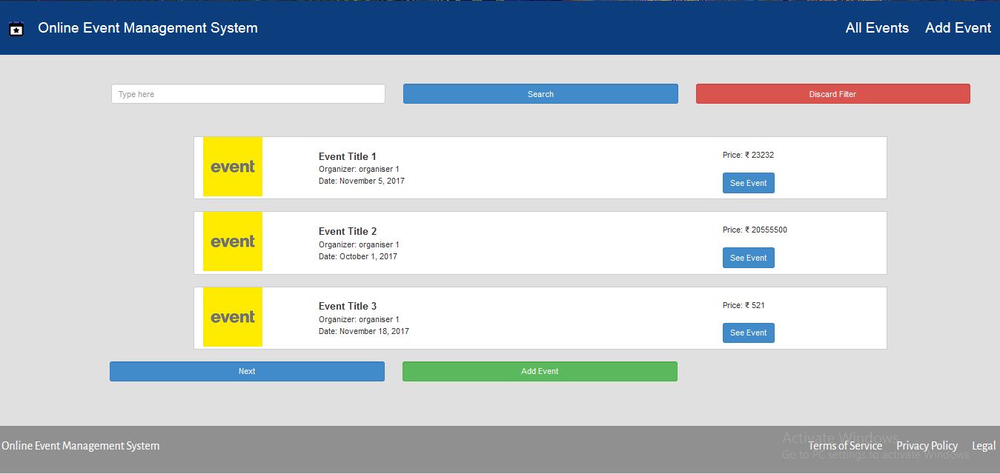
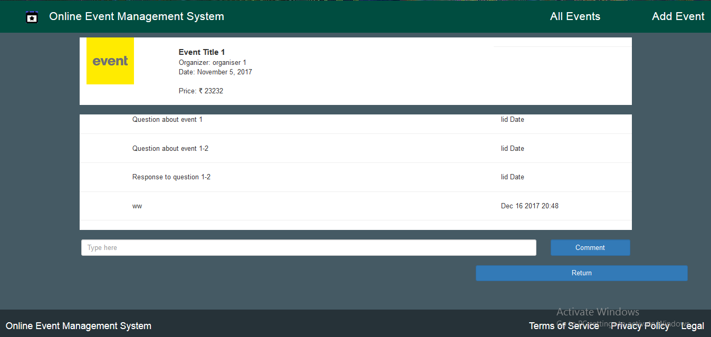
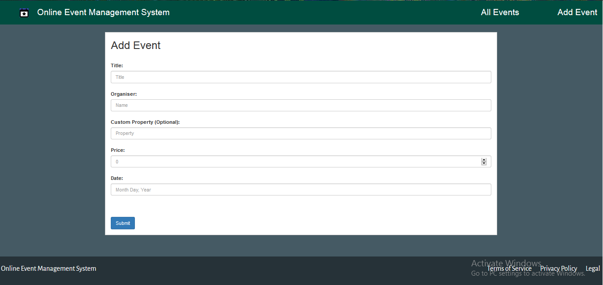

# Event Management System

## Synopsis
A system made in AngularJS with the help of APIs in [Postman Collection](https://www.getpostman.com/collections/765a863c27af1960eba8)

## Motivation

Assignment for CashPositive Internship

## Navigation
+Index page shows all the events 3 in a page. It also has an option to filter pages according to organizer and to discard the filter.
+Each event has an option to see event which shows individual event on a page with comments and option to add a new comment.
+Index page also has an option to add an event which takes us to a new page with inputs for all fields including myCustomProperty which is optional. 
+On submitting the event the page changes to individual event page for the new event.
+Each page has a footer and navigation bar. Navigation bar contains Title and logo (links to index page) and Add Event and All Events.

## Deplyoment
On [Heroku](https://basic-account.herokuapp.com/)

## Screenshots

